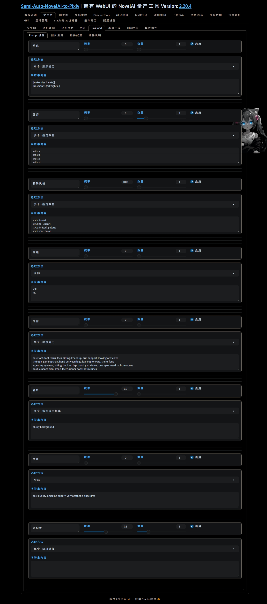
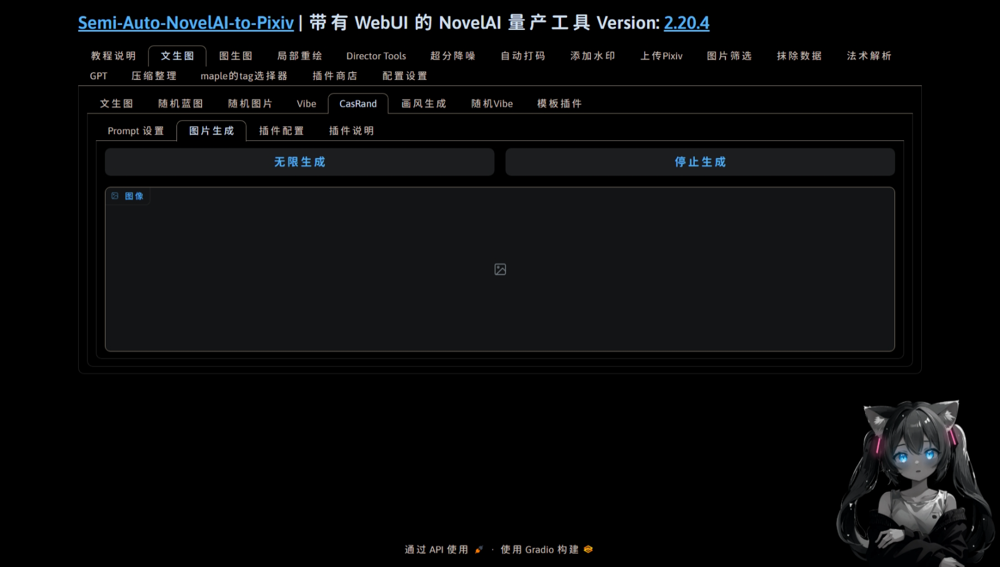
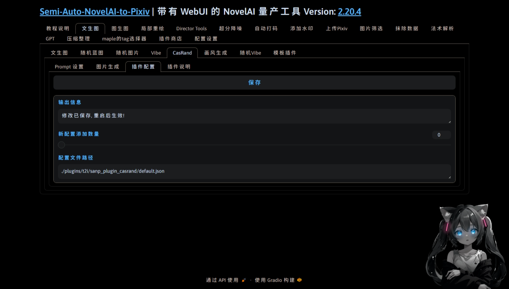
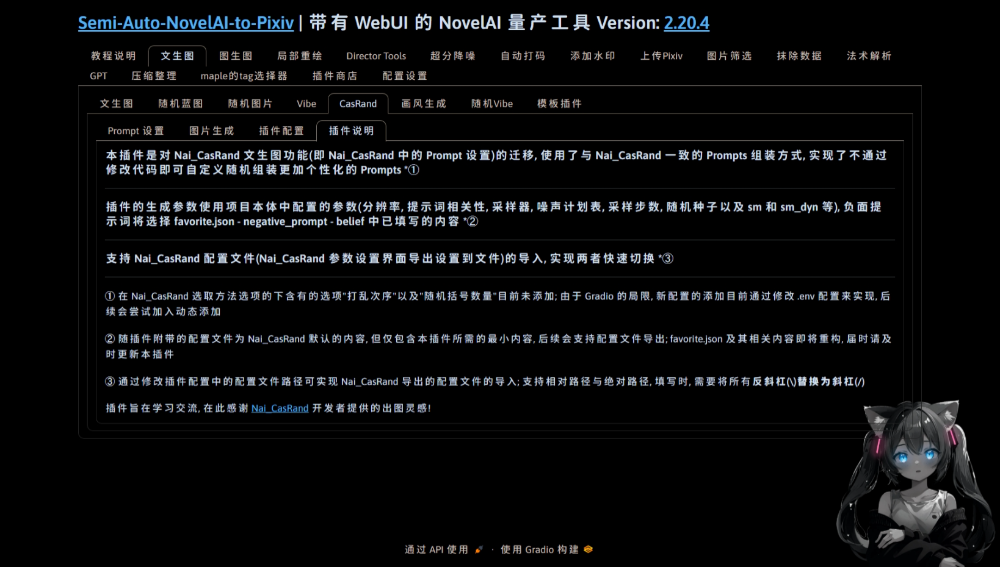

  </a>

<h1 align="center">sanp_plugin_casrand</h1>
<h4 align="center">✨适用于 Semi-Auto-NovelAI-to-Pixiv 的文生图插件, 出图逻辑与 NAI_CasRand 一致✨</h4>

    
    
    
    
    

## 💬 介绍

适用于 Semi-Auto-NovelAI-to-Pixiv 的文生图插件, 出图逻辑与 NAI_CasRand 一致

## ✨ 功能

## 💿 安装

- 方法1. 在插件商店粘贴本插件名字(sanp_plugin_casrand)并点击安装

- 方法2. 在[主体项目](https://github.com/zhulinyv/Semi-Auto-NovelAI-to-Pixiv) `plugins\t2i` 目录下直接克隆本项目

## 📖 待办

- [ ] 动态添加与删除组件
- [ ] 配置文件导出
- [ ] 路径支持反斜杠
- [ ] 支持 tags 顺序调整
- [ ] 支持嵌套配置

## 🤝 鸣谢

插件旨在学习交流, 在此感谢 [Nai_CasRand](https://github.com/Exception0x0194/NAI-Generator-Flutter) 开发者提供的出图灵感!